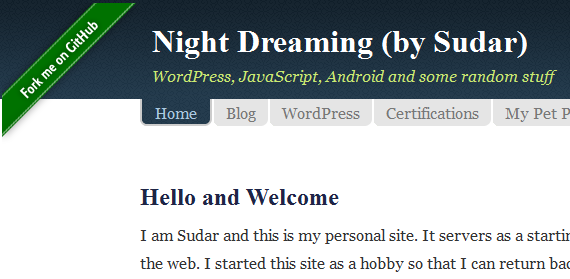
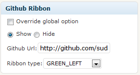

# Github Ribbon #
**Contributors:** sudar  
**Tags:** github, ribbon, git  
**Requires at least:** 2.8  
**Donate Link:** http://sudarmuthu.com/if-you-wanna-thank-me  
**Tested up to:** 3.5.1  
**Stable tag:** 0.8  

Adds "Fork me on Github" ribbons to your WordPress posts

## Description ##

Github Ribbons is a WordPress Plugin that allows you to add "Fork me on Github" ribbons to your WordPress posts or pages. You can enable the ribbon per post/page level or at global level.

### Features
The following are some of the features of the Plugin

- You can choose between image based ribbons or CSS3 based ribbons.
- You can choose whether to show the ribbon on the right side or on the left side.
- You can choose any one of the 6 different colours that are available.
- Configuration can be set either globally or on a post by post basic.

### Styling using CSS

If you want to style the ribbon yourself or add additional CSS styles to it (like adding `z-index` etc) then add it to the `.robbon-holder` CSS class.

### Development

The development of the Plugin happens over at [github][6]. If you want to contribute to the Plugin, fork the [project at github][6] and send me a pull request.

If you are not familiar with either git or Github then refer to this [guide to see how fork and send pull request](http://sudarmuthu.com/blog/contributing-to-project-hosted-in-github).

If you are looking for ideas, then you can start with one of the following TODO items :)

### TODO

The following are the features that I am thinking of adding to the Plugin, when I get some free time. If you have any feature request or want to increase the priority of a particular feature, then let me know.

- Add an ability to translate the text used inside the ribbon

### Support

- If you have found a bug/issue or have a feature request, then post them in [github issues][7]
- If you have a question about usage or need help to troubleshoot, then post in WordPress forums or leave a comment in [Plugins's home page][1]
- If you like the Plugin, then kindly leave a review/feedback at [WordPress repo page][8].
- If you find this Plugin useful or and wanted to say thank you, then there are ways to [make me happy](http://sudarmuthu.com/if-you-wanna-thank-me) :) and I would really appreciate if you can do one of those.
- Checkout other [WordPress Plugins][5] that I have released.
- If anything else, then contact me in [twitter][3].

 [1]: http://sudarmuthu.com/wordpress/github-ribbon
 [3]: http://twitter.com/sudarmuthu
 [4]: http://sudarmuthu.com/blog
 [5]: http://sudarmuthu.com/wordpress
 [6]: https://github.com/sudar/github-ribbon
 [7]: https://github.com/sudar/github-ribbon/issues
 [8]: http://wordpress.org/extend/plugins/github-ribbon/

## Translation ##

* Dutch (Thanks Rene of [WPwebshop ][2])
* Spanish (Thanks Mike Arias of [InMotion Hosting][3])
* Hindi (Thanks Love Chandel)
* Lithuanian (Thanks Vincent G)
* German (Thanks  Robert Wetzlmayr)

The pot file is available with the Plugin. If you are willing to do translation for the Plugin, use the pot file to create the .po files for your language and let me know. I will add it to the Plugin after giving credit to you.

 [2]: http://wpwebshop.com/
 [3]: http://www.inmotionhosting.com/
	
## Installation ##

Extract the zip file and just drop the contents in the wp-content/plugins/ directory of your WordPress installation and then activate the Plugin from Plugins page.

## Screenshots ##

1. Plugin in action in author's blog

2. Configuration screen

## Changelog ##

### v0.8 (2013-05-14) (Dev time: 0.5 hour) ###
* Fixed a bug which prevented the ribbon from showing on pages

### v0.7 (2012-12-08) (Dev time: 0.5 hour) ###
* Added German translations

### v0.6 (2012-07-10) (Dev time: 0.5 hour) ###
*   Added Hindi translations
*   Added Lithuanian translations

### v0.5 (2011-11-28) ###
*   Added Spanish translations

### v0.4 (2011-09-07) ###
*   Added CSS style to hide ribbon on printed pages

### v0.3 (2011-01-23) ###
*   Added Dutch translations

### v0.2 (2010-11-08) ###
*   Added option to use CSS3 ribbons

### v0.1 (2010-08-04) ###
*   Initial Release

## Readme Generator ##

This Readme file was generated using <a href = 'http://sudarmuthu.com/wordpress/wp-readme'>wp-readme</a>, which generates readme files for WordPress Plugins.
